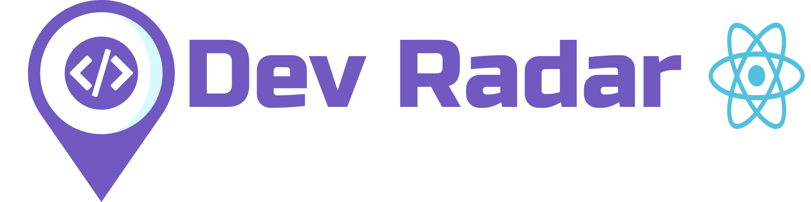

<header align="center" >
  
  

    Front-End Web da Aplicação usando ReactJS
  

  

    
  

</header>

  <a href="#tecnologias">Tecnologias</a>&nbsp;&nbsp;&nbsp;|&nbsp;&nbsp;&nbsp;
  <a href="#projeto">Projeto</a>&nbsp;&nbsp;&nbsp;|&nbsp;&nbsp;&nbsp;
  <a href="">Instruções para o FrontEnd</a>&nbsp;&nbsp;&nbsp;|&nbsp;&nbsp;&nbsp;
  <a href="https://github.com/will-souza97/dev-radar_backend">Dev Radar BackEnd</a>&nbsp;&nbsp;&nbsp;|&nbsp;&nbsp;&nbsp;
  <a href="">Dev Radar Mobile</a>

<h1 id="tecnologias">Tecnologias</h1>

Esse projeto foi desenvolvido com as seguintes tecnologias:

- [`React`](https://reactjs.org/)
- [`Axios`](https://www.npmjs.com/package/axios)
- [`Styled Components`](https://www.npmjs.com/package/styled-components)
- [`Polished`](https://www.npmjs.com/package/polished)
- [`Prop Types`](https://www.npmjs.com/package/prop-types)
- [`Dotenv`](https://www.npmjs.com/package/dotenv)

<h1 id="projeto">Projeto</h1>

O Dev Radar é uma aplicação de construida com uma API de geolocalização,
onde é possível cadastrar e excluir Devs e tambem realizar uma Busca por
Devs de acordo com as Tecnologias informadas.

<h1 id="instrucao">Instruções para o FrontEnd</h1>

Você precisará ter instalado na sua máquina o Node.js e o Yarn.

- Executar o comando `yarn` para fazer o dowload de todas as dependências necessárias para executar o projeto.

- Caso você tenha feito Deploy da sua API, copie todo o conteudo do arquivo `.env.example` e cole em um arquivo chamado `.env`

      REACT_URL_API= urldaapi.com

- Senão não será preciso do arquivo `.env`

Feitas as configurações, execute `yarn start` para que o Front-End esteja funcionando
